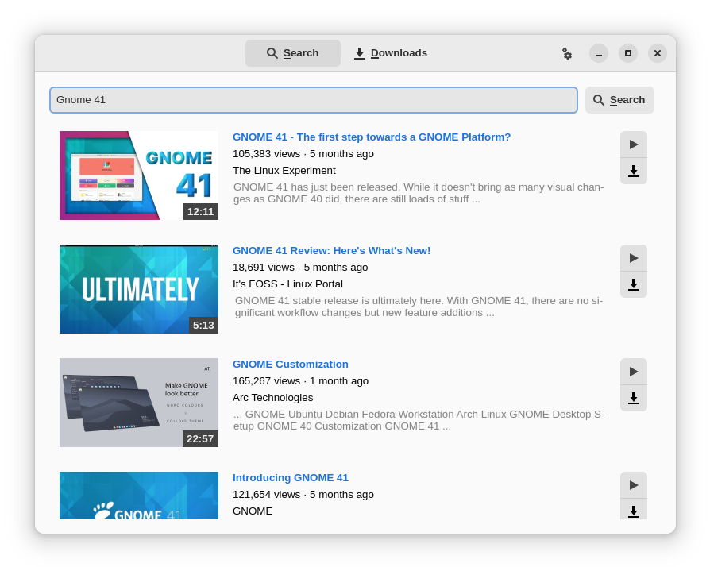

# gytparse

*gytparse* is a no-frills browser for YouTube made with libadwaita for the GNOME
desktop. Browse, stream and download videos with minimal distractions. It
harnesses the power of [mpv](https://mpv.io) and
[yt-dlp](https://github.com/yt-dlp/yt-dlp) to provide a disturbance-free
experience.

## Features

- Search for videos directly from your desktop; no login required.
- Stream videos using mpv and yt-dlp.
- Queue videos for download.
- Selectable qualities for download and streaming.
- Proxy support -- http(s) with authentication or SOCKS.

## Install

Currently only source installation is supported, although a flatpak is in
the works. For Arch Linux an AUR package is available and distribution
packages will be made available once libadwaita makes it to the repos.

|Distro| Link |
|:----:|:----:|
| Arch Linux | [`gytparse`](https://aur.archlinux.org/packages/gytparse) |

## Build

*gytparse* needs a relatively recent Python (≥ 3.8), `pygobject`, `requests`
and optionally `python-pysocks` for SOCKS proxy support. You will need `meson`
to build the project. To run locally

1. Clone this repository and `cd` into it.
2. Run `meson . _build` to assemble everything.
3. Run `./localrun.sh` to run from source.
4. To install run instead `meson . _build -Dprefix=/usr/local` and then
   `meson install -C _build` to copy the files over, although it is not
   recommended.

## Things missing

- Proper i18n support
- Cancellable and reorderable downloads
- Playlists

## License

*gytparse* is available under the terms of the
[Mozilla Public License 2.0](https://www.mozilla.org/en-US/MPL/2.0/).
